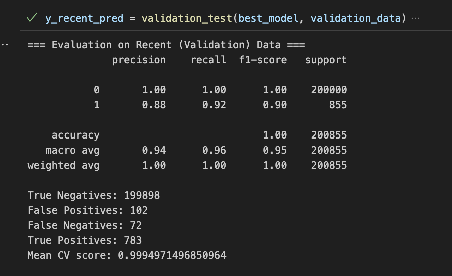

# Fraudulent bets detection model for bet exchange

# Project Overview

As a data scientist for my betting company, my first machine learning model I am building is a Fraudulent Bet detection model.
As online sports betting has become more popular, betting companies in the UK have created new ways of betting - Betting Exchange.
Similar to stock markets, betting exchange is a marketplace where customers can bet against each other in the exchange, 
and they are able to set their own price as a bookmaker with a few differences. Gamblers can buy or sell the outcome.
This created a new way of betting and entertainment for the customers, and bet exchange operators generate revenue by 
charging a small commission on winning bets.

The problem comes in now, like other finacial transactions, we are seeing increasingly more fradulent bets placed in the
betting exchange by betting against themself, to achieve fund passing, and some trying to make profits. 
See more at https://arbusers.com/fund-passing-at-betfair-t6198/

Bookmaker companies have been trying to catch fraudulent bets mannually for years, however it is highly insufficient and prone to error,
and these fradulent bets clients are likely to be using bots to achieve their purpose.

My job for the company and my first real world machine learning problem is to build a working machine learning model to detect
these fradulent bets efficiently and accurately.

# Data Science problem and my approach

I am using a binary classfication model where I classfy fradulent bets as 1 and non fradulent bets as 0.
Currently my model is still a beta model and I am only using XGBoost Classifier for now as I am still in the data engineering progress.

# Data collection

I have 3 years of bet data from the betting exchange, which is around 70 million rows of bets. As the company has been mannually finding fraudulent bets, we have around 20000 confirmed
fradulent bets for me to use in my training and test model.

I am only using past 1 year and 4 months of bets for now, because there are more updated features. 
To remove noise, I have decided only use winning bets to train my model, which will make the ROI comparison between fraud bet accounts more obvious.
Winning and losing bets are still used in feature engineerings. 

I am dividing my dataset to two parts, where first 1 year of data is used for the training and testing sets of the model. The more recent
4 months of data is used as the validation set for final checking, before I deploy it to detect frauds from daily new bets.

We are still constantly updating confirmed betids, and adding net daily bets into our total bets data.

# Model Evaluation

Model result on unseen validation set of 200 000 Non Fraud and 855 Fraud

This is the result where class 0 is Non-Fraud and class 1 is Fraud. 
Since there is a large mismatch between class 0 and class 1 data, we will mainly focus on the metric for class 0.

Precison and recall on class 0 are relatively accurate in my opinion, increased from initially around 40% recall rate on class 0.

As you can see precision rate is slightly lower than recall rate, but it makes sense because we figured that there are many hidden fraud bets in the non-fraud sample, due to historical detection limitation.

Overall, I am pleased with the result currently with the features we can use, and look forward to improve it in the future with additional new data and potential stronger features.

# Feature Selections

There are currently around 58 different features I am still testing and comparing with, where most features I engineered myself.
Here is a table of all the data I engineered with the original raw data from our back end database, with most of them being quite important for
our model.

| Engineered Features                | Definition                                                                                        |
|------------------------------------|---------------------------------------------------------------------------------------------------|
| total_client_roi_before_bet        | The cumulative total ROI of this account at the time of this bet was matched                      |
| lay_liquidity                      | The liquidity of the lay bets of this selection, at the time this bet was matched                 |
| back_liquidity                     | The liquidity of the back bets of this selection, at the time this bet was matched                |
| num_of_selection_bets_before       | The number of bets placed in this exact selection before this bet was matched                     |
| daily_profit                       | Total profit of this bet's account within 24 hours                                                |
| daily_stakes                       | Total stake matched of this bet's account within 24 hours                                         |
| profit_ratio                       | Profit of this bet divided by stake matched of this bet                                           |
| price_ratio                        | Price of the bet / Average price within 30mins of the bet's selection                             |
| total_matched_ratio                | The stake matched for this bet divided by total liquidity matched for this exact selection        |
| betplace_matchstart_timedifference | The time difference between the start time of the match versus the match time of the bet, in "ms" |
| bet_create_matched_timedifference  | The time difference between the creation versus the match time of this bet, in "ms"               |
| competition_counts                 | The number of times of the competition of this bet has appeared in all the bets.                  |
| pnl_7days                          | The total PnL of the customer in the last 7 days                                                  |
| num_of_client_bets_before_bet      | The number of bets that the customer has placed with this account in the past                     |
| total_client_profit_before_bet     | The total profit of the customer in this account before this bet was placed                       |
| total_client_roi                   | The history ROI of the account of this bet                                                        |
| registration_time                  | The creation date of the first bet that the customer made, in "ms"                                |
| time_since_first_bet               | The time between this bet and the first bet that the account has placed, in "ms"                  |
| selection_encoded                  | Encoded the string column selection name into a numerical column                                  |
| event_name_encoded                 | Encoded the string column event name into a numerical column                                      |
| customerid_encoded                 | Encoded the string column customer id into a numerical column                                     |
| total_selection_bets_num           | The total number of bets placed for this specific bet selection                                   |
| 10mins_avg_price                   | The mean price of this bet selection over the last 10 minutes before this bet was placed          |
| price_range                        | The range of the price of this specific bet selection                                             |

